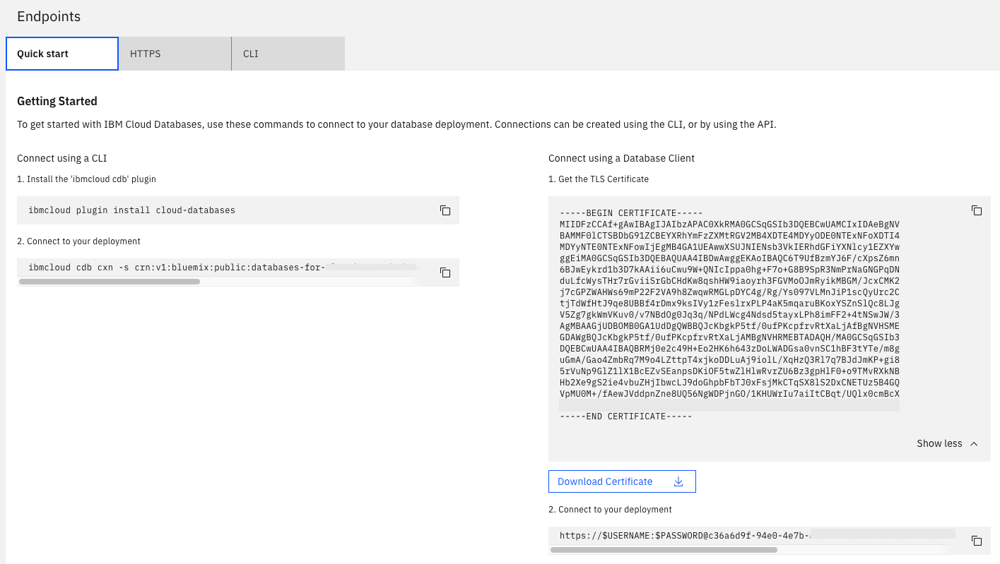

---
copyright:
  years: 2026
lastupdated: "2026-05-21"

keywords: mysql, databases, mysql connection strings, gen2

subcollection: databases-for-mysql-gen2

---

{{site.data.keyword.attribute-definition-list}}

# Getting connection strings
{: #connection-strings}

[Gen 2]{: tag-purple}

To connect to {{site.data.keyword.databases-for-mysql_full}}, you need some users and connection strings. Connection Strings for your deployment are displayed on the _Dashboard Overview_, in the _Endpoints_ panel.

{: caption="Endpoints panel on the Dashboard Overview" caption-side="bottom"}

A {{site.data.keyword.databases-for-mysql}} deployment is provisioned with an admin user and, after [setting the admin password](/docs/databases-for-mysql-gen2?topic=databases-for-mysql-gen2-user-management&interface=ui#user-management-set-admin-password-ui), use its connection strings to connect to your deployment.
{: .tip}

**CLI**
You can also grab connection strings from the [CLI](/docs/databases-cli-plugin?topic=databases-cli-plugin-cdb-reference#deployment-connections).
```sh
ibmcloud cdb deployment-connections example-deployment -u <newusername> [--endpoint-type <endpoint type>]
```
{: pre}

Full connection information is returned by the `ibmcloud cdb deployment-connections` command with the `--all` flag. To retrieve all the connection information for a deployment named "example-deployment", use the following command.
```sh
ibmcloud cdb deployment-connections example-deployment -u <newusername> --all [--endpoint-type <endpoint type>]
```
{: pre}

If you don't specify a user, the `deployment-connections` commands return information for the admin user by default. If you don't specify an endpoint type, the connection string returns the public endpoint by default. If your deployment has only a private endpoint, you must specify `--endpoint-type private` or the commands return an error. The user and endpoint type is not enforced. You can use any user on your deployment with either endpoint (if both exist on your deployment).

To use the `ibmcloud cdb` CLI commands, you must [install the {{site.data.keyword.databases-for}} plug-in](/docs/databases-for-mysql-gen2?topic=databases-for-mysql-gen2-icd-cli&interface=ui#icd-cli-install).
{: .tip}

**API**
To retrieve user's connection strings from the API, use the [`/users/{userid}/connections`](https://{DomainName}/apidocs/cloud-databases-api#discover-connection-information-for-a-deployment-f-e81026) endpoint. You must specify in the path the user endpoint (public or private) in the returned connection strings. The user and endpoint type is not enforced. You can use any user on your deployment with either endpoint (if both exist on your deployment).
```sh
curl -X GET -H "Authorization: Bearer $APIKEY" 'https://api.{region}.databases.cloud.ibm.com/v4/ibm/deployments/{id}/users/{userid}/connections/{endpoint_type}'
```
{: pre}

## Connection String Breakdown
{: #connection-string-breakdown}

### The MySQL Section
{: #connection-string-breakdown-mysql}

The "mysql" section contains information that is suited to applications that make connections to `mysql`.

| Field Name | Index | Description |
| ---------- | ----- | ----------- |
| `Type` | | Type of connection - for MySQL, it is "URI". |
| `Scheme` | | Scheme for a URI - for MySQL, it is "mysql". |
| `Path`| |Path for a URI - for MySQL, it is the database name. The default is `ibmclouddb`. |
| `Authentication` | `Username` | The username that you use to connect. |
| `Authentication` | `Password` | A password for the user - might be shown as `$PASSWORD`. |
| `Authentication` | `Method` | How authentication takes place; "direct" authentication is handled by the driver. |
| `Hosts` | `0...` | A hostname and port to connect to. |
| `Composed` | `0...` | A URI combining Scheme, Authentication, Host, and Path. |
| `Certificate` | `Name` | The allocated name for the service proprietary certificate for database deployment. |
| `Certificate` | Base64 | A base64 encoded version of the certificate. |
{: caption="mysql/URI connection information" caption-side="top"}

* `0...` indicates that there might be one or more of these entries in an array.

### The CLI Section
{: #connection-string-breakdown-cli}

The "CLI" section contains information that is suited for connecting with `mysql`.

| Field Name | Index | Description |
| ---------- | ----- | ----------- |
| `Bin` | | The recommended binary to create a connection; in this case it is `mysql`. |
| `Composed`| | A formatted command to establish a connection to your deployment. The command combines the `Bin` executable, `Environment` variable settings, and uses `Arguments` as command line parameters. |
| `Environment`| | A list of key/values you set as environment variables. |
| `Arguments` | 0... | The information that is passed as arguments to the command shown in the Bin field.
| `Certificate`|Base64| A service proprietary certificate that is used to confirm that an application is connecting to the appropriate server. It is base64 encoded. |
| `Certificate` | Name | The allocated name for the service proprietary certificate. |
| `Type` | | The type of package that uses this connection information; in this case `cli`. |
{: caption="mysql/cli connection information" caption-side="top"}

* `0...` indicates that there might be one or more of these entries in an array.
